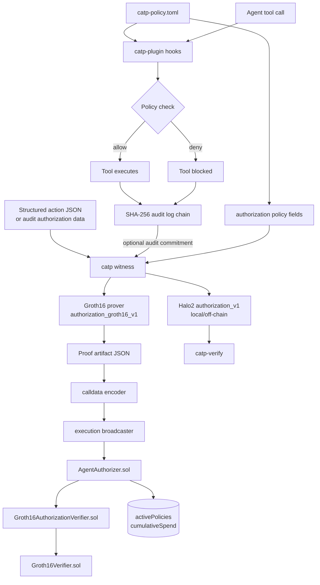
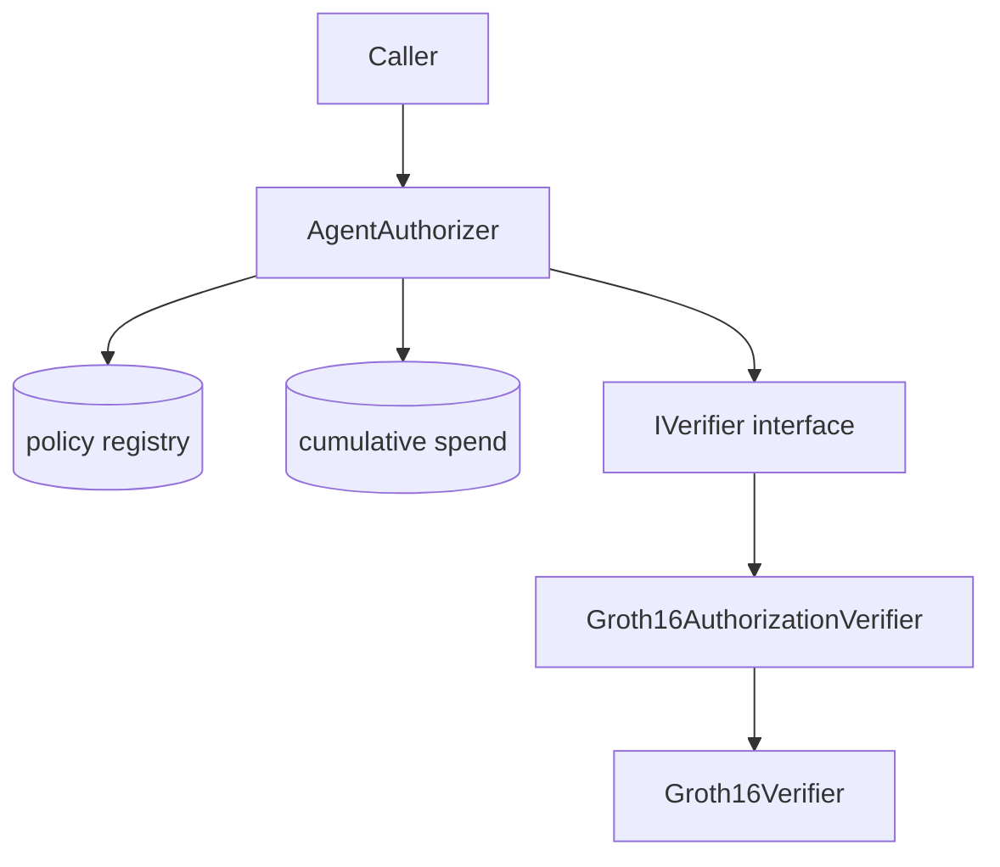

# CATP Architecture

CATP is a proof-centric agent authorization system. The current repository contains:

- a local enforcement plugin for Claude Code
- a tamper-evident audit log
- an authorization proof statement
- a Groth16/BN254 EVM verifier path for testnet execution
- a Halo2/KZG off-chain verifier path
- Solidity contracts and TypeScript SDK adapters for verifiable authorization

The protocol boundary is the versioned authorization statement and its public input schema. The current EVM implementation is a reference deployment, not the protocol boundary.

---

## Current Architecture

CATP is currently an enforcement + authorization system, not a full agent
network stack. The repository is intentionally scoped to two production
surfaces:

```text
Local enforcement
  Claude Code hooks, TOML policy checks, tamper-evident audit log

Verifiable authorization
  private policy commitment, structured action witness, proof manifest,
  Groth16 EVM verifier path, Halo2 off-chain verifier path
```

The local enforcement plugin is the developer-facing product surface. When a
tool call or action has structured authorization data, it can feed the
authorization witness/proof flow.

Future protocol areas such as encrypted messaging, output verification,
reputation, and registry/discovery are extension spaces. They should not
re-enter the active architecture until they have a concrete proof statement,
integration plan, and test strategy.

---

## Current Components

```text
catp-plugin
  Claude Code hooks, TOML policy engine, audit log, witness command

catp-circuits/authorization
  Halo2 authorization_v1 circuit and off-chain proof path

catp-circuits/groth16
  Groth16 authorization_groth16_v1 circuit, proving/verifying keys,
  proof artifact generator, generated Solidity verifier

catp-contracts/src/authorization
  AgentAuthorizer, ActionData, Groth16AuthorizationVerifier, Groth16Verifier

catp-sdk/src/authorization
  TypeScript proof artifact adapters and authorizer calldata helpers

catp-verify
  Rust off-chain verification endpoint/library

scripts
  verifier generation, setup checks, size checks, deployment, proof,
  calldata encoding, and execution scripts
```

---

## Current Data Flow



---

## Local Enforcement Surface

The local enforcement surface is implemented by `catp-plugin`.

Inputs:

- `catp-policy.toml`
- Claude Code `PreToolUse` hook event
- Claude Code `PostToolUse` hook event

Outputs:

- allow/deny decision before a tool call executes
- audit log entry after tool execution or denial
- SHA-256 commitment chain for audit-log integrity

Policy rules are evaluated top-to-bottom. The first matching rule determines whether the tool call is allowed. Unmatched tools are allowed by default.

Audit entries are written under:

```text
${CATP_HOME:-~/.catp}/audit/<agentId>/<YYYY-MM-DD>/actions.jsonl
```

Each audit entry includes a commitment linked to the previous entry commitment.

---

## Authorization Policy Schema

The current Groth16 EVM authorization path uses a fixed policy family with variable private parameters.

Private policy fields:

```text
allowed_action
allowed_protocol
allowed_token
max_value_per_tx
max_value_total
valid_from
valid_until
```

Public action fields:

```text
actionType
protocol
token
value
currentTimestamp
cumulativeSpend
```

The current proof family supports different parameter values inside this schema. It does not support arbitrary runtime policy programs inside the Groth16 circuit.

---

## Authorization Proof Statement

Current EVM proof version:

```text
authorization_groth16_v1
```

The proof verifies that:

- the private policy hashes to the public `policyCommitment`
- `actionType == allowed_action`
- `protocol == allowed_protocol`
- `token == allowed_token`
- `value > 0`
- `value <= max_value_per_tx`
- `cumulativeSpend + value <= max_value_total`
- `valid_from <= currentTimestamp`
- `currentTimestamp <= valid_until`

The public input layout has 13 values:

```text
0      policyCommitment
1      actionType
2-5    protocol limbs
6-9    token limbs
10     value
11     currentTimestamp
12     cumulativeSpend
```

`protocol` and `token` are exposed as four little-endian 64-bit limbs each.

---

## Proof Systems

CATP currently contains two authorization proof paths.

| Proof version | Backend | Role | Status |
|---------------|---------|------|--------|
| `authorization_groth16_v1` | Groth16/BN254 | EVM/testnet path | Deployed and smoke-tested on Sepolia |
| `authorization_v1` | Halo2/KZG/BN254 | Local/off-chain path | Verifies off-chain; generated Solidity verifier is not EVM-deployable for this circuit |

The Groth16 verifier runtime is about 6.4 KB. The Groth16 authorization wrapper runtime is about 1.1 KB.

The generated Halo2 Solidity verifier for the current circuit is about 319 KB of runtime bytecode, above the EVM 24,576-byte runtime limit.

The checked-in Groth16 proving and verifying keys are deterministic dev/testnet keys. They are not a mainnet ceremony.

---

## EVM Contract Architecture



### AgentAuthorizer

`AgentAuthorizer` owns the EVM authorization control flow.

State:

- `activePolicies: bytes32 -> bool`
- `policyDelegators: bytes32 -> address`
- `cumulativeSpend: bytes32 -> uint256`

External methods:

- `registerPolicy(bytes32 policyCommitment)`
- `revokePolicy(bytes32 policyCommitment)`
- `executeAuthorized(bytes32 policyCommitment, bytes actionData, uint256 currentTimestamp, bytes proof)`
- `isPolicyActive(bytes32 policyCommitment)`
- `getCumulativeSpend(bytes32 policyCommitment)`

`executeAuthorized`:

1. checks that the policy is active
2. decodes `ActionData`
3. checks value, spend, and timestamp bounds
4. builds the 13 public inputs
5. calls `verifier.verify(publicInputs, proof)`
6. increments cumulative spend

### Groth16AuthorizationVerifier

`Groth16AuthorizationVerifier` adapts CATP's generic verifier interface to the generated gnark verifier.

It checks:

- exactly 13 public inputs
- proof length is exactly 256 bytes

Then it decodes the proof into `uint256[8]` and calls:

```text
Groth16Verifier.verifyProof(uint256[8] proof, uint256[13] input)
```

### Groth16Verifier

`Groth16Verifier` is the generated Solidity verifier for `authorization_groth16_v1`.

---

## TypeScript SDK Architecture

The SDK exposes authorization proof helpers for proof artifact consumption.

Key files:

```text
catp-sdk/src/authorization/Groth16ProofArtifact.ts
catp-sdk/src/authorization/AuthorizerClient.ts
```

Main adapter flow:

```text
Groth16 proof artifact JSON
  -> groth16ArtifactToAuthorizationCall
  -> executeAuthorizedArgsFromGroth16Call
  -> AgentAuthorizer.executeAuthorized args
```

The SDK validates proof artifact shape before converting it into EVM call fields.

---

## Script Architecture

Authorization operational scripts live in `scripts/`.

| Script | Purpose |
|--------|---------|
| `generate-groth16-verifier.sh` | Generate Groth16 verifier, proof fixture, and setup manifest |
| `prove-groth16-authorization.sh` | Build witness and generate proof artifact |
| `encode-groth16-execute.sh` | Validate proof artifact and encode registration/execution calldata |
| `execute-groth16-authorization.sh` | Dry-run or broadcast proof execution |
| `deploy-groth16-sepolia.sh` | Deploy Groth16 verifier, wrapper, and authorizer |
| `smoke-groth16-sepolia.sh` | Run Sepolia proof execution smoke test |
| `check-groth16-setup.sh` | Check setup, verifier, wrapper, build artifacts, and deployment metadata |
| `check-groth16-verifier-size.sh` | Check EVM runtime sizes |

Root npm aliases:

```text
npm run groth16:generate
npm run groth16:prove
npm run groth16:encode-execute
npm run groth16:execute
npm run groth16:size
npm run groth16:check
```

---

## Deployment Metadata

Sepolia Groth16 deployment metadata is stored in:

```text
catp-contracts/deployments/sepolia-groth16.json
```

The metadata records:

- chain id and network
- deployed contract addresses
- proof version
- verifier and wrapper source hashes
- proving and verifying key hashes
- runtime byte sizes
- deployed runtime code hashes
- deployment transactions and gas
- smoke-test transaction metadata

Sensitive values such as RPC URLs and private keys are not stored in deployment metadata.

---

## Trust Boundaries

### Local machine

The local machine runs:

- policy evaluation
- hook execution
- audit log writing
- witness generation
- proof generation

The local machine has access to raw policy files and action data.

### Public verifier

The public verifier sees:

- `policyCommitment`
- action public inputs
- proof bytes
- EVM state required by `AgentAuthorizer`

The public verifier does not see private policy parameters except what is revealed by public inputs and successful authorization behavior.

### EVM state

The current EVM contract stores:

- active policy commitments
- policy delegator addresses
- cumulative spend per policy commitment

The proof binds `cumulativeSpend`, and the contract checks it against current on-chain state before updating spend.

---

## Repository Boundary

This repository contains source code, generated dev/testnet proof artifacts, deployment metadata, and public documentation.

The repository must not contain:

- private keys
- RPC credentials
- API keys
- mnemonics
- real `.env` files

Use `catp-contracts/.env.example` as the placeholder format for local environment variables.
