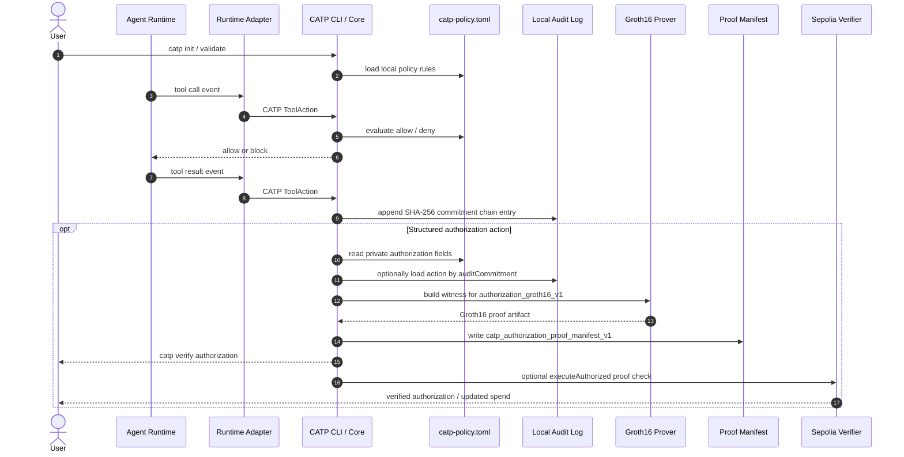

# CATP - Cryptographic Agent Trust Protocol

CATP is an authorization protocol for AI agents: it enforces local policy
decisions, records tamper-evident audit trails, and can turn structured agent
actions into verifiable authorization artifacts.

The active project has two connected surfaces:

1. **Local enforcement**: a runtime-neutral policy core blocks tool calls outside a project policy and writes a tamper-evident audit log; Claude Code is the first supported adapter.
2. **Verifiable authorization**: witness and proof manifest tooling link structured actions to committed policies. Groth16/BN254 is the current optional EVM verification backend, not the protocol itself.

See [ARCHITECTURE.md](ARCHITECTURE.md) for the current system shape and [IMPLEMENTATION_PLAN.md](IMPLEMENTATION_PLAN.md) for the active roadmap.

---

## Current Scope

```text
In scope
Local enforcement core            runtime adapters + TOML policy + SHA-256 audit log
Authorization proof manifests     audit-linked witness + manifest validation
Optional EVM verification         authorization_groth16_v1 = Groth16/BN254, Sepolia smoke passed
Off-chain proof research          authorization_v1 = Halo2/KZG/BN254, not EVM-deployable

Future extension space
Output verification               output commitments + attestor/challenge design
Encrypted communication           agent-to-agent or principal-to-agent encrypted messages
Reputation                        privacy-preserving performance properties
Registry and discovery            capability proofs + discovery records
```

The current product is complete enough to stand alone as an enforcement +
authorization protocol. ZK is not required for local enforcement or audit-log
integrity. It is an optional backend for privacy-preserving verification when a
third party, contract, or external system needs a compact authorization proof.

---

## Current MVP Flow



The npm CLI covers local enforcement, audit logs, witness generation, and proof
manifest tooling. Full Groth16 proof generation and Sepolia execution require a
repository checkout because the prover scripts, circuit assets, and contract
deployment metadata live in this repo.

---

## Package Boundary

CATP intentionally keeps the published npm CLI small:

- `@catp-protocol/cli`: local enforcement, audit logs, witness generation,
  authorization proof manifests, and artifact validation.
- Repository checkout: Groth16 proof generation, calldata encoding, Sepolia
  execution, contracts, circuits, and setup/deployment checks.
- `catp-circuits/wasm` and SDK `ProofClient`: local Halo2/off-chain
  `authorization_v1` helpers. They are not currently published as `catp-wasm`
  and are not the active EVM path.

The active EVM/testnet proof path is `authorization_groth16_v1`. The Halo2
`authorization_v1` path remains useful for off-chain verification and
proof-system research.

---

## Authorization Proof Systems

CATP currently contains two authorization proof paths.

| Path | Role | Status |
|------|------|--------|
| `authorization_groth16_v1` | Current EVM verifier path | Works on Sepolia; compact verifier runtime is about 6.4 KB and wrapper runtime is about 1.1 KB |
| `authorization_v1` Halo2 | Off-chain verifier / research path | Works locally; EVM verifier path was removed after generated runtime exceeded the EVM 24,576-byte limit |

Groth16 does require a circuit-specific trusted setup. The keys currently checked into `catp-circuits/groth16/keys/` are stable dev/testnet keys, not a mainnet ceremony. A mainnet release must either run and document a proper ceremony or explicitly choose a weaker trust model.

Any change to public inputs, policy encoding, circuit constraints, commitment hash, proof backend, or setup keys should create a new proof version and verifier address.

---

## Quick Start - Local Enforcement

`catp-plugin` runs as Claude Code hooks. It evaluates every tool call against a TOML policy file and writes a tamper-evident audit log with a SHA-256 commitment chain.

No blockchain or ZK setup is required for local enforcement.

Claude Code is the first supported runtime adapter, not the protocol boundary.
The local enforcement core consumes CATP `ToolAction` events:

```text
runtime adapter -> ToolAction -> policy decision -> audit entry
```

Future runtimes should plug in by mapping their tool-call events into
`ToolAction` while leaving the policy engine, audit logger, witness builder, and
proof manifest flow unchanged.

### Install

For a fuller installation guide, see [docs/INSTALL.md](docs/INSTALL.md).

Option A - npm:

```bash
npm install -g @catp-protocol/cli@0.2.2
```

The npm package covers local enforcement, audit logs, witness generation, and
proof manifest validation. Full Groth16 proof generation requires cloning the
repository because the prover scripts and circuit assets are not bundled into
the CLI package.

Option B - clone and build:

```bash
git clone https://github.com/lfzkoala/catp.git
cd catp
bash install.sh
```

This installs dependencies, compiles the plugin, and symlinks the `catp` binary to `~/.local/bin/`.

If `catp` is not found after install, add `~/.local/bin` to your PATH:

```bash
echo 'export PATH="$HOME/.local/bin:$PATH"' >> ~/.zshrc && source ~/.zshrc
# or for bash:
echo 'export PATH="$HOME/.local/bin:$PATH"' >> ~/.bashrc && source ~/.bashrc
```

### Wire Claude Code Hooks

Add to `~/.claude/settings.json`:

```json
{
  "hooks": {
    "PreToolUse": [{
      "matcher": ".*",
      "command": "catp hook pre --runtime claude-code"
    }],
    "PostToolUse": [{
      "matcher": ".*",
      "command": "catp hook post --runtime claude-code"
    }]
  }
}
```

`--runtime claude-code` is currently the only supported runtime adapter and is
also the default. It is shown explicitly so future runtime integrations have a
stable hook boundary.

List supported runtime adapters with:

```bash
catp hook runtimes
```

### Configure a Policy

```bash
cd your-project/
catp init
catp validate
```

Example `catp-policy.toml`:

```toml
[agent]
id = "my-agent"
version = "1"

[[rules]]
tool = "Bash"
allow = false
pattern = ["rm -rf *", "sudo *", "curl * | bash"]
reason = "Destructive or remote-execution commands are blocked"

[[rules]]
tool = "Write"
allow = false
path_allowlist = ["src/**", "tests/**"]
reason = "Deny writes to paths outside src/ and tests/"

[[rules]]
tool = "WebFetch"
allow = true
reason = "Web reads are unrestricted"
```

Rules are evaluated top-to-bottom; first match wins. Unmatched tools are allowed by default.

### View the Audit Log

```bash
catp log show
catp log verify
```

Logs are written to `${CATP_HOME:-~/.catp}/audit/<agentId>/<YYYY-MM-DD>/actions.jsonl`. Each entry chains on the previous commitment hash, forming a tamper-evident sequence.

`catp anchor` can submit a Merkle root of local audit commitments on-chain.
Structured authorization proofs use a separate private policy commitment path
verified by `authorization_groth16_v1` on EVM or by the off-chain verifier path.

---

## End-to-End Groth16 Authorization

This is the current EVM path. It proves that an action is allowed by a private committed policy, then executes that proof through `AgentAuthorizer.executeAuthorized`.

The proof statement is versioned as:

```text
authorization_groth16_v1
```

Public inputs:

- `policyCommitment`
- `actionType`
- `protocol[4]`
- `token[4]`
- `value`
- `currentTimestamp`
- `cumulativeSpend`

The Solidity execution path is:

```text
AgentAuthorizer
  -> Groth16AuthorizationVerifier
    -> Groth16Verifier
```

### 1. Add Authorization Policy Fields

Add a structured `[authorization]` section to `catp-policy.toml`:

```toml
[authorization]
allowed_action = "Swap"
allowed_protocol = "0xaaaaaaaaaaaaaaaaaaaaaaaaaaaaaaaaaaaaaaaaaaaaaaaaaaaaaaaaaaaaaaaa"
allowed_token = "0xbbbbbbbbbbbbbbbbbbbbbbbbbbbbbbbbbbbbbbbbbbbbbbbbbbbbbbbbbbbbbbbb"
max_value_per_tx = "1000"
max_value_total = "10000"
valid_from = "1778042786"
valid_until = "1778129246"
```

### 2. Create Action JSON

```json
{
  "actionType": "Swap",
  "protocol": "0xaaaaaaaaaaaaaaaaaaaaaaaaaaaaaaaaaaaaaaaaaaaaaaaaaaaaaaaaaaaaaaaa",
  "token": "0xbbbbbbbbbbbbbbbbbbbbbbbbbbbbbbbbbbbbbbbbbbbbbbbbbbbbbbbbbbbbbbbb",
  "value": "500"
}
```

### 3. Generate a Proof Artifact

Use a fresh timestamp near execution time. `AgentAuthorizer` rejects proofs older than five minutes.

```bash
npm run groth16:prove -- \
  --action action.json \
  --current-timestamp 1778042846 \
  --cumulative-spend 0 \
  --out authorization_groth16_v1.json
```

The script builds a witness with `catp witness` and passes it to the Groth16 prover.

You can also build a witness from an audit entry that recorded `tool_input.catp_authorization` or `tool_input.authorization`:

```bash
catp witness \
  --audit-commitment <64-char-audit-commitment> \
  --out witness.json
```

When `catp witness --out ...` succeeds, the summary includes a ready-to-edit
`proveCommand=catp prove authorization ...` line using the same action or audit
commitment source.

To generate a proof artifact and shareable manifest in one command from the
repository checkout:

```bash
catp prove authorization \
  --action action.json \
  --current-timestamp 1778042846 \
  --cumulative-spend 0 \
  --artifact-out authorization_groth16_v1.json \
  --deployment catp-contracts/deployments/sepolia-groth16.json \
  --out catp-proof-manifest.json
```

For an audit-linked action, use the audit commitment directly:

```bash
catp prove authorization \
  --audit-commitment <64-char-audit-commitment> \
  --artifact-out authorization_groth16_v1.json \
  --deployment catp-contracts/deployments/sepolia-groth16.json \
  --out catp-proof-manifest.json
```

### 4. Encode Calldata Without Broadcasting

```bash
npm run groth16:encode-execute -- \
  --artifact authorization_groth16_v1.json \
  --out execute-authorized.calldata.json
```

This validates the proof artifact and emits calldata for:

- `registerPolicy(bytes32)`
- `executeAuthorized(bytes32,bytes,uint256,bytes)`

The encoder checks the contract-facing artifact shape before emitting calldata:
13 public inputs, a 128-byte ABI `actionData` payload, a 256-byte proof, and
matching policy commitment, action fields, value, timestamp, and cumulative
spend.

### 5. Dry-Run Execution

```bash
npm run groth16:execute -- \
  --artifact authorization_groth16_v1.json \
  --dry-run
```

Dry-run does not require RPC credentials and does not broadcast.

### 6. Execute on Sepolia

Load RPC credentials from `catp-contracts/.env` or your shell:

```bash
set -a
source catp-contracts/.env
set +a
```

Then broadcast:

```bash
npm run groth16:execute -- \
  --artifact authorization_groth16_v1.json \
  --out execute-authorized.receipt.json
```

The script:

- reads `AgentAuthorizer` from `catp-contracts/deployments/sepolia-groth16.json` unless `--authorizer` is passed
- registers the policy only if inactive
- checks that the proof artifact's `cumulativeSpend` matches on-chain state
- broadcasts `executeAuthorized`
- writes receipt metadata when `--out` is provided

### 7. Share a Proof Manifest

If you already have a proof artifact, create a portable manifest that links the
proof, public inputs, verifier/deployment metadata, and optional audit
commitment:

```bash
catp prove authorization \
  --artifact authorization_groth16_v1.json \
  --deployment catp-contracts/deployments/sepolia-groth16.json \
  --out catp-proof-manifest.json

catp verify authorization --manifest catp-proof-manifest.json
```

For audit-linked manifests, verify that the audit commitment exists in the local
audit log:

```bash
catp verify authorization \
  --manifest catp-proof-manifest.json \
  --check-audit
```

`catp verify authorization` currently performs structural manifest validation.
With `--check-audit`, it also checks that the manifest's audit commitment exists
for the recorded audit agent and that the audit entry's structured
authorization action matches the manifest action data, value, timestamp, and
cumulative spend when those audit fields are present. Cryptographic proof
verification is performed by the EVM verifier or the dedicated off-chain
verifier path.

See [docs/E2E_GROTH16_SEPOLIA.md](docs/E2E_GROTH16_SEPOLIA.md) for the full
end-to-end flow and [docs/SECURITY_REVIEW_AUTHORIZATION.md](docs/SECURITY_REVIEW_AUTHORIZATION.md)
for the authorization proof review checklist.

For a minimal runnable policy/action fixture, see
[examples/authorization-basic](examples/authorization-basic).

---

## Deployment and Verification Commands

Generate or refresh the Groth16 verifier, proof fixture, and setup manifest:

```bash
npm run groth16:generate
```

Check the persisted Groth16 setup, verifier source, wrapper source, build artifacts, and Sepolia metadata:

```bash
npm run groth16:check
```

Check verifier runtime sizes:

```bash
npm run groth16:size
```

Deploy the compact Groth16 verifier path:

```bash
scripts/deploy-groth16-sepolia.sh --dry-run
scripts/deploy-groth16-sepolia.sh
```

Run the Sepolia smoke script:

```bash
scripts/smoke-groth16-sepolia.sh
```

Run the Solidity Groth16 adapter tests:

```bash
cd catp-contracts
forge test --match-path test/authorization/Groth16AuthorizationVerifier.t.sol
```

---

## Halo2 Path

The Halo2 authorization proof version is:

```text
authorization_v1
```

It uses:

- Halo2/KZG on BN254
- `k=12`
- GWC opening
- EVM transcript
- 13 public inputs

This path is available for off-chain verification and proof-system research. It is not the current EVM deployment path because the generated Solidity verifier exceeded the EVM runtime bytecode limit and the Halo2 EVM adapter has been removed from the active repository surface.

The committed `catp-authorization-k12.srs` is for development and testnet consistency. Mainnet Halo2 usage would require documented SRS provenance or replacement with accepted ceremony output.

---

## Repository Structure

```text
catp/
├── catp-plugin/            # TypeScript — local enforcement plugin
│   └── src/
│       ├── policy/         # TOML loader, rule engine
│       ├── audit/          # Commitment chain logger and verifier
│       ├── hook/           # pre.ts / post.ts hook handlers
│       └── commands/       # init, validate, log, witness CLI commands
├── catp-circuits/          # Rust/Go — ZK circuits and verifier generators
│   ├── authorization/      # Halo2 ProveAuthorization circuit + SRS + e2e tests
│   ├── groth16/            # gnark Groth16 authorization verifier path
│   └── wasm/               # wasm-pack source bindings; pkg/ is generated
├── catp-contracts/         # Solidity — verifiers + protocol contracts
│   └── src/authorization/         # AgentAuthorizer, verifier wrappers, proof adapters
├── catp-sdk/               # TypeScript — developer-facing SDK
│   └── src/authorization/         # types, PolicyBuilder, AuthorizerClient, ProofClient
└── catp-verify/            # Rust — off-chain proof verification endpoint
```

---

## Current Status

| Area | Component | Status |
|------|-----------|--------|
| Local enforcement | `catp-plugin` - Claude Code enforcement + audit log | Complete; published as `@catp-protocol/cli` |
| Authorization | `authorization_groth16_v1` compact EVM verifier | Sepolia smoke passed; real proof execution passing |
| Authorization | `Groth16Verifier.sol` | Generated verifier runtime about 6.4 KB |
| Authorization | `Groth16AuthorizationVerifier.sol` | Wrapper runtime about 1.1 KB |
| Authorization | `AgentAuthorizer.sol` + `ActionData.sol` | Complete |
| Authorization | Groth16 proof/execution scripts | Complete for testnet flow: prove, encode, dry-run, execute |
| Authorization | TypeScript SDK proof helpers | Complete locally |
| Authorization | `authorization_v1` Halo2 circuit | Complete locally; EVM verifier blocked by bytecode size |
| Authorization | `catp-verify` Rust endpoint | Complete |
| Future extensions | output verification, messaging, reputation, registry/discovery | Not active repo surface |

Run the checks in [CONTRIBUTING.md](CONTRIBUTING.md) before changing protocol or verifier code.

---

## Prerequisites

Local enforcement only:

| Tool | Version |
|------|---------|
| Node.js | >= 20 |
| npm | >= 10 |

Full stack:

| Tool | Version | Used by |
|------|---------|---------|
| Node.js | >= 20 | catp-plugin, catp-sdk |
| npm | >= 10 | root scripts, catp-plugin |
| pnpm | >= 9 | catp-sdk |
| Rust | stable via `rust-toolchain.toml` | catp-circuits, catp-verify |
| Go | >= 1.23 | gnark Groth16 prover |
| Foundry | latest | catp-contracts, deploy/smoke scripts |
| jq | any modern version | shell scripts |

Install Foundry:

```bash
curl -L https://foundry.paradigm.xyz | bash
```

---

## Contributing

Contributions are welcome. Please open an issue before starting significant work so we can coordinate.

See [CONTRIBUTING.md](CONTRIBUTING.md) for per-component dev setup, coding conventions, and commit message format.

---

## License

[MIT](LICENSE)
